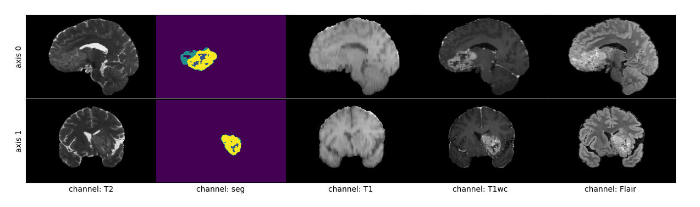
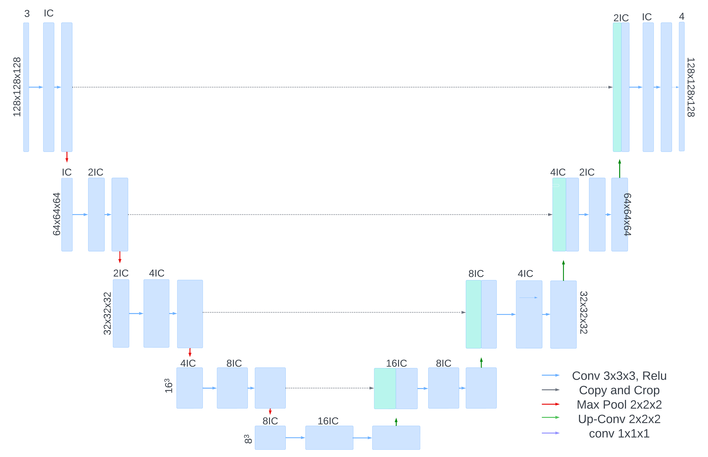
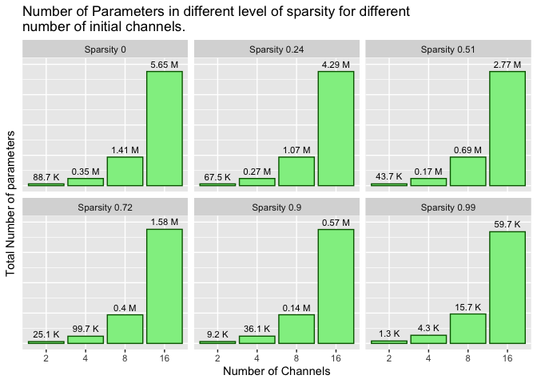
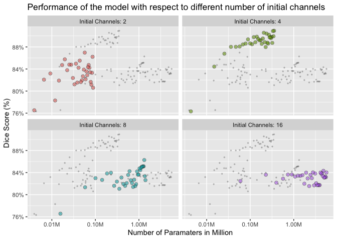
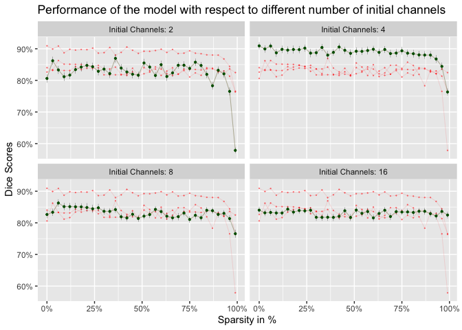

## 1 Introduction

Image segmentation is a task related to computer vision. The objective
is to locate image pixels that are part of some interested regions with
distinguishable color, texture, and intensity compared to the other
pixels. For example, the task of segmentation with a Brain MRI image
would be to provide a segmented map of the same dimension as the input
data containing the value of zero or one where the value one is an
indication that the corresponding pixel is a part of the tumor. U-Net is
one of the state-of-the-art neural network architectures which can
perform image segmentation tasks quite well. U-Net consists of an
encoder and decoder parts. The encoder extracts the generalized feature
while the decoder tries to reconstruct the segmented true mask annotated
by human Ronneberger, Fischer, and Brox (2015). However, the Brain Timer
Segmentation dataset {BRATS dataset citation} on which the paper has
been worked is 3D data and needs to apply a 3D U-Net model Çiçek et al.
(2016). In both the encoder and decoder block the U-Net architecture
consists of 5 layers where in each consecutive layer for the encoder
block the number of channels/features gets doubled. If the initial layer
contains 64 output features, the last layer will contain 1024 features
Ronneberger, Fischer, and Brox (2015). Hence eliminating the unnecessary
weights becomes essential since a model with more than 90% sparsity can
achieve the same performance as the unpruned model Frankle and Carbin
(2018). In the case of detecting the unimportant weight, the magnitude
of the weights can be used which will lead to an unstructured method of
pruning LeCun, Denker, and Solla (1989). This paper will examine the
optimal sparsity for different numbers of initial channels for the U-Net
3D model with the BRATS dataset {Cite BRATS 2021} and will try to
compare the approach of training a network with a large number of
parameters and then optimally pruned the network to get a smaller
sub-network vs training a smaller network with same number of total
parameters as the pruned sub-network to see which approach give more
accuracy.

## 2 Related Work

Working with the BRATS Dataset {Cite BRATS 2021} is nothing new. This
dataset was used for many tasks such as proposing new and modified
architecture for the U-Net model. According to Henry et al. (2021), a
four-stage network with the fifth stage embedded in the fourth stage can
surplus the segmentation performance compared to a five-stage layer as
stated in the U-Net2D Ronneberger, Fischer, and Brox (2015) and U-Net3D
Çiçek et al. (2016) architecture. In other research, some other models
such as U-Net++ Zhou et al. (2018), replacing the convolutional layer of
U-Net with factorizer block Ashtari et al. (2023) or ViT (visual
transformer) block Paul and Chen (2022)} and so on are developed which
structurally deviates a lot from the initially proposed U-Net
architecture. On the other hand, the work on network pruning shows that
a network can be pruned without reducing the accuracy. Though there are
many works or pruning approaches and the works show that random pruning
is not a good approach Frankle and Carbin (2018), the methodologies
described in those works are not consistent Blalock et al. (2020). Li et
al. (2016) work with structured pruning where a whole layer of the
filter is pruned. On the other hand, Frankle and Carbin (2018) works
with the CNN architecture with the method of unstructured pruning
technique where weight is omitted based on the magnitude value and can
still find the sub-network that can match the accuracy of the full-size
model. However, there is no direct work that can provide the answer
about what is the maximum amount of sparsity that can provide similar
performance as a full-size unpruned U-Net model.

## 3 Methodology

To prune the network this paper will use the rewinding pruning method
Frankle et al. (2019) rather than the method described in the original
LTH (Loterry Ticket Hypothesis) Frankle and Carbin (2018) paper. Because
the U-Net architecture that has been used in this work is considerably
deeper than the conv2, conv4, and conv6 architecture on which the
original LTH paperwork. This algorithm works in six steps according to
Frankle et al. (2019):

Here the parameter k is set to 2, 4, 6, and 8 to find out the effect of
stability. To make the U-Net architecture under-parameterized to
over-parameterized the initial number of channels are chosen as 2, 4, 8,
and 16. The early stopping criteria are set as: whether the dice score
on the validation set is improving or not for 6 epochs and it is assumed
that the optimal number of epoch is less than or equal to 50.

## Dataset

In our study, we utilized a total of 1151 fMRI observations,
distributing them across training, validation, and testing sets
containing 804, 173, and 174 observations respectively. Each observation
comprised five channels (T1, T1Gd, T2, T2-FLAIR, and Annotated Label)
alongside radiologist-annotated pixels indicating 3 types of brain tumor
cells (necrotic tumor core: label 1, peritumoral edematous/invaded
tissue: label 2, GD-enhancing tumor: label 4). The tensor dimensions for
each individual stood at 5x240x240x155. However, our focus primarily
centered on the central grid of the brain image, a 128x128x128 cube. As
a result, we cropped each channel down to fit this grid, reducing the
dimensions to 4x128x128x128. Additionally, after observation, we found
no discernible information regarding tumor cells when inspecting the T1
channel. Consequently, we omitted this channel, resulting in the final
input size for each observation becoming 4x128x128x128.

<figure>

<figcaption aria-hidden="true">Brain fMRI images</figcaption>
</figure>

## Architecture UNet3D

The network design includes 4 sets of encoder blocks and 4 sets of
decoder blocks, with a shared layer in the fifth set. Each level of the
network consists of a pattern made of (Conv3D + BatchNorm3D + Relu +
Conv3D + BatchNorm3D + Relu). The channels in each level are twice the
number of the previous level.

In the encoder part, a Maxpool layer is used to reduce the image size by
half, while in the decoder part, Transpose Convolution doubles the image
size. The network takes a 4-channel, 128x128x128 dimensional input
tensor and produces a 4-channel, 128x128x128 dimensional output mask.
These channels represent different aspects: healthy cells, necrotic
tumor core (labeled 1), peritumoral edematous/invaded tissue (labeled
2), and GD-enhancing tumor (labeled 4). For a detailed view, please
refer to Figure 2, displaying the architecture.

<figure>

<figcaption aria-hidden="true">Unet Architecture. Here IC is the initial
number channels. For this experienmts the value of IC equals to 2, 4, 8,
and 16</figcaption>
</figure>

## Experiments

In this paper, we experimented with the U-Net3D neural network using
various initial channel numbers: 16 channels (Parameters: 5.65M), 8
channels (Parameters: 1.41M), 4 channels (Parameters: 0.35M), and 2
channels (Parameters: 88.3M). These networks were pruned to achieve 99%
sparsity, significantly reducing the parameter count compared to the
original model: 16 channels (Parameters: 59.7K), 8 channels (Parameters:
15.7K), 4 channels (Parameters: 4.3K), and 2 channels (Parameters:
1.3K).

Figure 3 provides a summary of the parameter count. They used an
interactive pruning technique, gradually removing 3% of the weights in
each iteration. Training stopped when there was no improvement on the
validation set for six consecutive iterations or when the iteration
count reached 50. They trained a total of 4x34 models, maintaining a
constant learning rate of 0.0002 using the ADAM optimizer, and used a
batch size of 4 observations. To assess model performance, they employed
20 bootstrap resampling methods to calculate the dice score on the
testing set.

<figure>

<figcaption aria-hidden="true">Total number of parameters has been
trimed using the unstructured pruning methods to get different level of
sparsity.</figcaption>
</figure>

## Top Performance

The table displays the top three performing models for each number of
initial channels. Interestingly, for both over-parameterized and
under-parameterized models, the sparse model demonstrated the best
performance. However, with the model starting with 4 initial channels, a
trend of declining performance was noticed as the number of parameters
decreased.

| channels | sparcity |  mean  |    sd    |
|:--------:|:--------:|:------:|:--------:|
|    2     |   0.36   | 0.8697 | 0.01323  |
|    2     |   0.03   | 0.8621 | 0.01298  |
|    2     |   0.78   | 0.8575 | 0.01142  |
|    4     |    0     | 0.9092 | 0.01121  |
|    4     |  40.12   | 0.9091 | 0.01017  |
|    4     |   0.06   | 0.9088 | 0.01002  |
|    8     |   0.06   | 0.8628 |  0.0119  |
|    8     |   0.09   | 0.8514 | 0.01178  |
|    8     |   0.12   | 0.8513 | 0.01202  |
|    16    |   0.15   | 0.8432 | 0.009421 |
|    16    |   0.51   | 0.8403 | 0.01049  |
|    16    |    0     | 0.8402 | 0.01064  |

<figure>

<figcaption aria-hidden="true">The performance with respect to different
number of parameters. The colored points are the observation belongs to
the group of the same number of initial channels and the black dots
represents the other observations for comparisons.</figcaption>
</figure>

## Loterry Tickets

The sparsity is not harming the model performance. This trend can be
seen on all the cases.

<figure>

<figcaption aria-hidden="true">The green line representing the
perfromance of the performance of the models belongs to that group. The
black lines are kept for the comparison with the models belongs to the
other groups.</figcaption>
</figure>

## Future Work

A significant instability was noticed across various sparsity levels
within the same model family. The next objective of the study is to
enhance the stability of the network’s characteristics when subjected to
pruning methods.

## Referances

Ashtari, Pooya, Diana M Sima, Lieven De Lathauwer, Dominique
Sappey-Marinier, Frederik Maes, and Sabine Van Huffel. 2023.
“Factorizer: A Scalable Interpretable Approach to Context Modeling for
Medical Image Segmentation.” *Medical Image Analysis* 84: 102706.

Blalock, Davis, Jose Javier Gonzalez Ortiz, Jonathan Frankle, and John
Guttag. 2020. “What Is the State of Neural Network Pruning?”
*Proceedings of Machine Learning and Systems* 2: 129–46.

Çiçek, Özgün, Ahmed Abdulkadir, Soeren S Lienkamp, Thomas Brox, and Olaf
Ronneberger. 2016. “3D u-Net: Learning Dense Volumetric Segmentation
from Sparse Annotation.” In *Medical Image Computing and
Computer-Assisted Intervention–MICCAI 2016: 19th International
Conference, Athens, Greece, October 17-21, 2016, Proceedings, Part II
19*, 424–32. Springer.

Frankle, Jonathan, and Michael Carbin. 2018. “The Lottery Ticket
Hypothesis: Finding Sparse, Trainable Neural Networks.” *arXiv Preprint
arXiv:1803.03635*.

Frankle, Jonathan, Gintare Karolina Dziugaite, Daniel M Roy, and Michael
Carbin. 2019. “Stabilizing the Lottery Ticket Hypothesis.” *arXiv
Preprint arXiv:1903.01611*.

Henry, Theophraste, Alexandre Carré, Marvin Lerousseau, Théo Estienne,
Charlotte Robert, Nikos Paragios, and Eric Deutsch. 2021. “Brain Tumor
Segmentation with Self-Ensembled, Deeply-Supervised 3D u-Net Neural
Networks: A BraTS 2020 Challenge Solution.” In *Brainlesion: Glioma,
Multiple Sclerosis, Stroke and Traumatic Brain Injuries: 6th
International Workshop, BrainLes 2020, Held in Conjunction with MICCAI
2020, Lima, Peru, October 4, 2020, Revised Selected Papers, Part i 6*,
327–39. Springer.

LeCun, Yann, John Denker, and Sara Solla. 1989. “Optimal Brain Damage.”
*Advances in Neural Information Processing Systems* 2.

Li, Hao, Asim Kadav, Igor Durdanovic, Hanan Samet, and Hans Peter Graf.
2016. “Pruning Filters for Efficient Convnets.” *arXiv Preprint
arXiv:1608.08710*.

Paul, Sayak, and Pin-Yu Chen. 2022. “Vision Transformers Are Robust
Learners.” In *Proceedings of the AAAI Conference on Artificial
Intelligence*, 36:2071–81. 2.

Ronneberger, Olaf, Philipp Fischer, and Thomas Brox. 2015. “U-Net:
Convolutional Networks for Biomedical Image Segmentation.” In *Medical
Image Computing and Computer-Assisted Intervention–MICCAI 2015: 18th
International Conference, Munich, Germany, October 5-9, 2015,
Proceedings, Part III 18*, 234–41. Springer.

Zhou, Zongwei, Md Mahfuzur Rahman Siddiquee, Nima Tajbakhsh, and
Jianming Liang. 2018. “Unet++: A Nested u-Net Architecture for Medical
Image Segmentation.” In *Deep Learning in Medical Image Analysis and
Multimodal Learning for Clinical Decision Support: 4th International
Workshop, DLMIA 2018, and 8th International Workshop, ML-CDS 2018, Held
in Conjunction with MICCAI 2018, Granada, Spain, September 20, 2018,
Proceedings 4*, 3–11. Springer.
